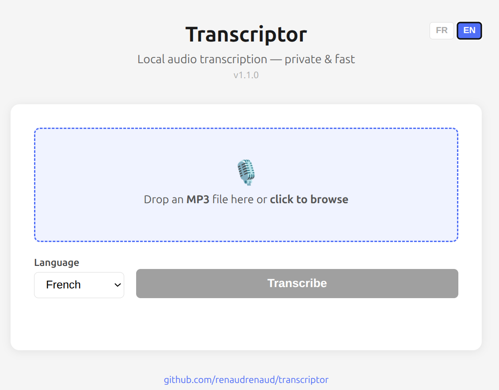

# transcriptor

[English version](README_EN.md)

Transformez vos enregistrements audio en texte, **localement**, **rapidement**, **en toute confidentialité**.

Transcriptor exploite la puissance GPU des machines **AMD Strix Halo** (GMKTec EVO2, Asus ROG Flow Z13 2025…) pour transcrire une heure d'enregistrement en moins de deux minutes — sans envoyer une seule donnée dans le cloud. Le texte produit peut ensuite être soumis à un LLM pour générer un compte rendu, extraire des décisions, ou produire tout autre document structuré.

## Pourquoi Transcriptor ?

- **Confidentialité totale** : l'audio ne quitte jamais la machine. Les fichiers sont traités en mémoire dans le container — aucune trace ne reste côté serveur après la transcription. Idéal pour les réunions sensibles.
- **Rapide** : ~2 minutes pour 1 heure d'audio sur les machines Strix Halo de notre parc.
- **Simple** : une commande pour démarrer, une commande pour transcrire.
- **Flexible** : l'API compatible OpenAI Whisper permet l'intégration dans n'importe quel pipeline de traitement.

## Flux de travail typique

```
Enregistrement audio  →  Transcription (Transcriptor)  →  LLM  →  Compte rendu
     meeting.mp3              meeting.txt                          compte_rendu.md
```



## Démarrage rapide

```bash
docker compose up -d
```

- **Interface web** : `http://localhost:8765`
- **CLI** : `./transcribe.sh ~/Téléchargements/meeting.mp3`

Voir les [runbooks](#runbooks) pour l'installation complète et les options avancées.

## Performances

Sur les machines équipées d'un **AMD AI 395 (Strix Halo)** — comme le GMKTec EVO2 ou l'Asus ROG Flow Z13 2025 — une heure d'audio MP3 est transcrite en environ **2 minutes**.

## Runbooks

- [Installation](runbooks/install.md) — prérequis, pull de l'image, démarrage, dépannage
- [Interface web](runbooks/webui.md) — accès depuis le réseau local (port 8765), utilisation, dépannage
- [Enregistrement](runbooks/enregistrement.md) — capturer un meeting (micro + interlocuteurs)
- [Transcription](runbooks/transcription.md) — transcrire un fichier audio (CLI)

## Structure

```
transcriptor/
├── docker-compose.yml
├── transcribe.sh
├── adr/
│   ├── 001-whisper-cpp.md
│   ├── 002-vulkan-backend.md
│   └── 003-image-pre-compilee.md
└── runbooks/
    ├── install.md
    ├── enregistrement.md
    └── transcription.md
```
