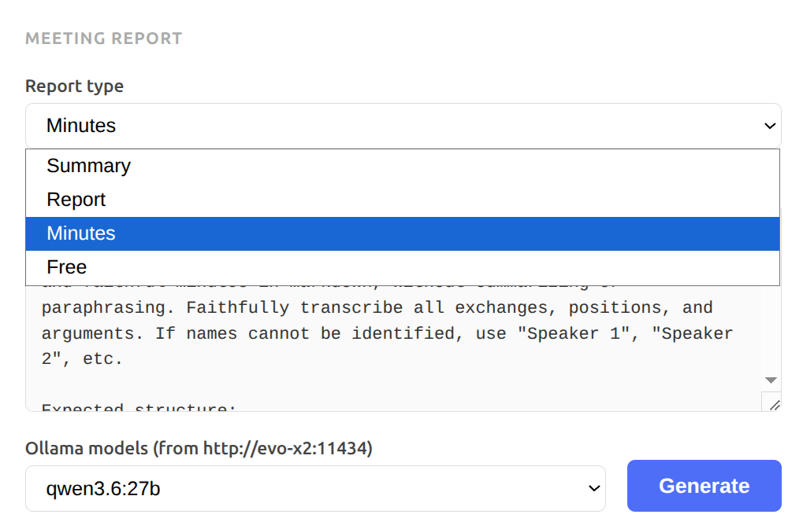

# Runbook — Web interface

Browser-based transcription interface, shared over the local network.

## Prerequisites

The whisper server and frontend must be running:

```bash
docker compose up -d
```

## Access

Open in a browser from any machine on the local network:

```
http://<host-ip>:8765
```

From the host machine:

```
http://localhost:8765
```

## Usage

1. Drag and drop an audio file (or click to browse)
2. Select the language (default: `fr`)
3. Click **Transcrire**
4. Wait — approximately 2 minutes per hour of audio
5. Copy the text or download as `.txt`

## Report generation (Ollama)

After transcription, the text can be submitted to Ollama — running locally on the same Strix Halo machine, accelerated by the AMD GPU — to produce a structured document.

1. Select the report type from the dropdown
2. Choose the Ollama model
3. Click **Generate**
4. The response is displayed in real-time streaming
5. Copy the result or download it as `.md`



Available types:

- **Summary** — short version with key points, decisions and action items
- **Report** — structured synthesis by topic
- **Minutes** — faithful and exhaustive transcription
- **Free** — custom prompt

Models that have delivered good results: `gpt-oss:20b`, `gpt-oss:120b`, `qwen3.6:27b`.

## Privacy

The audio file is processed in memory inside the whisper container. No trace remains server-side after transcription — neither the audio file nor the text. Report generation via Ollama is also local: no data leaves the machine.

## Ollama connectivity and CORS

### Why the browser cannot contact Ollama directly

The model list and report generation run as JavaScript **in the browser** — it is not the nginx server that calls Ollama, it is the browser itself. The browser connects to Ollama at the URL defined in `frontend/config.json`.

When the browser makes a call to a different port (e.g. `8765` → `11434`), this is a **cross-origin** request. The browser sends an `Origin` header containing the URL shown in the address bar. Ollama checks whether that origin is allowed before responding.

Example: when accessing `http://evo-x2:8765`, the browser sends `Origin: http://evo-x2:8765` to Ollama on port `11434`. If that origin is not in Ollama's list → request blocked, no models visible.

### OLLAMA_ORIGINS variable

On the Ollama container, set the environment variable:

```
OLLAMA_ORIGINS=http://evo-x2:8765
```

Multiple origins separated by commas:

```
OLLAMA_ORIGINS=http://evo-x2:8765,http://my-local-machine:8765
```

Wildcard (all origins allowed):

```
OLLAMA_ORIGINS=*
```

### Risk levels by value

| Value | Security | Recommended use |
|---|---|---|
| `http://evo-x2:8765` | High — only this frontend is allowed | Server exposed to the internet |
| `http://evo-x2:8765,http://other:8765` | High — explicit list | Multiple known frontends |
| `*` | Low — any web page can call Ollama | Private local network only |

> **Note:** the Docker container IP (`172.17.x.x`) is useless here — it never appears in the browser's address bar, so it never appears in the `Origin` header.

### Check in the browser console

If models do not appear, open the console (F12): a `blocked by CORS policy` error confirms that `OLLAMA_ORIGINS` is missing or does not include the current origin.

## Troubleshooting

### Page not accessible

```bash
docker compose ps
# Both containers must be "Up": whisper and frontend
```

### 504 Gateway Time-out error

The audio file is too long for the configured timeout (600s). Check the file duration — beyond ~4 hours of audio, increase `proxy_read_timeout` in `frontend/nginx.conf`.

### Find the host machine IP

```bash
ip route get 1 | awk '{print $7; exit}'
```
